# CineFlow 2.0: UML Class Diagram & Multi-Movie Architecture
**Project**: CineFlow 2.0 - Multi-Movie Production House System (Horizon Studios)  
**Affiliation**: Sri Sivasubramaniya Nadar College of Engineering (SSN) - Dept of Computer Science & Engineering  

---

## 1. Visual Mermaid Class Diagram

```mermaid
classDiagram
    direction TB

    %% -------------------------------------------------------------
    %% INTERFACES
    %% -------------------------------------------------------------
    class Identifiable~ID~ {
        <<interface>>
        +getId() ID
    }

    class Reportable {
        <<interface>>
        +generateDetailedReport() String
    }

    class CostTrackable {
        <<interface>>
        +computeTotalCost() double
        +getCostBreakdown() String
    }

    class Schedulable {
        <<interface>>
        +getScheduledDate() LocalDate
        +hasScheduleConflict(LocalDate date, String timeSlot) boolean
    }

    class CostEstimator {
        <<functional interface>>
        +estimate(Scene scene, int shootDays) double
    }

    class ConflictValidator {
        <<functional interface>>
        +isValid(Scene scene, LocalDate targetDate, String timeSlot) boolean
    }

    class Repository~T, ID~ {
        <<interface>>
        +save(T entity) void
        +saveAll(Collection~T~ entities) void
        +findById(ID id) Optional~T~
        +findAll() List~T~
        +deleteById(ID id) boolean
        +existsById(ID id) boolean
        +count() int
        +persistToStorage(String filePath) void
        +loadFromStorage(String filePath) void
    }

    %% -------------------------------------------------------------
    %% STUDIO & MULTI-MOVIE ENTITIES
    %% -------------------------------------------------------------
    class ProductionHouse {
        -String id
        -String name
        -String headquarters
        -int establishedYear
        -Map~String, Movie~ movies
        -String activeMovieId
        +ProductionHouse()
        +ProductionHouse(String id, String name, String headquarters, int establishedYear)
        +addMovie(Movie movie) void
        +getMovie(String movieId) Optional~Movie~
        +getAllMovies() List~Movie~
        +getActiveMovie() Movie
        +setActiveMovie(Movie movie) boolean
        +setActiveMovie(String movieId) boolean
        +getMovieCount() int
        +generateDetailedReport() String
    }

    class Movie {
        -String id
        -String title
        -String genre
        -String directorName
        -ProductionPhase productionPhase
        -int estimatedReleaseYear
        -BudgetService budgetService
        -List~Scene~ scenes
        -PriorityQueue~Scene~ shootingQueue
        -List~CallSheet~ callSheets
        -Set~String~ actorIds
        -Set~String~ crewIds
        -Set~String~ equipmentIds
        -Set~String~ locationIds
        +Movie()
        +Movie(String id, String title, String genre, String directorName)
        +Movie(String id, String title, String genre, String directorName, ProductionPhase phase, int releaseYear)
        +addScene(Scene scene) void
        +addScenes(Scene... scenes) void
        +refreshShootingQueue() void
        +assignActor(String actorId) void
        +assignCrew(String crewId) void
        +bookEquipment(String equipmentId) void
        +bookLocation(String locationId) void
        +computeTotalCost() double
        +getCostBreakdown() String
        +generateDetailedReport() String
    }

    %% -------------------------------------------------------------
    %% PERSONNEL HIERARCHY (Abstract Class & Inheritance)
    %% -------------------------------------------------------------
    class Person {
        <<abstract>>
        #String id
        #String name
        #String email
        #String phone
        #double dailyRate
        #int daysWorked
        +Person()
        +Person(String id, String name, double dailyRate)
        +Person(String id, String name, String email, String phone, double dailyRate)
        +calculateRemuneration(int days)* double
        +getRoleTitle()* String
        +recordDaysWorked(int days) void
        +getId() String
        +getName() String
        +getDailyRate() double
    }

    class Actor {
        -String characterName
        -int billingOrder
        -String agency
        -boolean stuntQualified
        -Set~String~ specialSkills
        -Set~String~ assignedSceneIds
        +Actor()
        +Actor(String id, String name, double dailyRate, String characterName, int billingOrder)
        +assignRole(String characterName) void
        +assignRole(String characterName, int billingOrder) void
        +assignRole(String characterName, int billingOrder, String agency) void
        +addSkill(String skill) void
        +calculateRemuneration(int days) double
        +generateDetailedReport() String
    }

    class CrewMember {
        -Department department
        -String designation
        -boolean unionAffiliated
        -String[] certifications
        +CrewMember()
        +CrewMember(String id, String name, double dailyRate, Department department, String designation)
        +addCertification(String cert) void
        +calculateRemuneration(int days) double
        +generateDetailedReport() String
    }

    class Director {
        -String creativeVisionStatement
        -double profitPoints
        -double flatDirectorialFee
        +Director()
        +Director(String id, String name, double dailyRate, String vision, double profitPoints, double flatFee)
        +calculateRemuneration(int days) double
        +generateDetailedReport() String
    }

    %% -------------------------------------------------------------
    %% PHYSICAL ASSETS HIERARCHY
    %% -------------------------------------------------------------
    class ProductionAsset {
        <<abstract>>
        #String id
        #String name
        #double dailyRentalCost
        #int daysBooked
        #boolean available
        +ProductionAsset()
        +ProductionAsset(String id, String name, double dailyRentalCost)
        +bookDays(int days) void
        +getAssetCategory()* String
        +getId() String
        +getName() String
        +getDailyRentalCost() double
    }

    class Equipment {
        -String serialNumber
        -EquipmentCategory category
        -String conditionRating
        -boolean requiresSpecializedInsurance
        +Equipment()
        +Equipment(String id, String name, double dailyRentalCost, String serialNumber, EquipmentCategory category, String conditionRating, boolean requiresInsurance)
        +computeTotalCost() double
        +getCostBreakdown() String
        +generateDetailedReport() String
    }

    class Location {
        -String address
        -String city
        -LocationType locationType
        -boolean permitsGranted
        -int maxCrewCapacity
        -double municipalPermitFee
        +Location()
        +Location(String id, String name, double dailyRentalCost, String address, String city, LocationType locationType, boolean permitsGranted, int maxCrewCapacity, double municipalPermitFee)
        +computeTotalCost() double
        +getCostBreakdown() String
        +generateDetailedReport() String
    }

    %% -------------------------------------------------------------
    %% PRODUCTION ENTITIES
    %% -------------------------------------------------------------
    class Scene {
        -String id
        -String movieId
        -int sceneNumber
        -String title
        -String synopsis
        -double scriptPages
        -DaylightRequirement daylightRequirement
        -SceneStatus status
        -int priority
        -LocalDate scheduledDate
        -String shootTimeSlot
        -String locationId
        -Set~String~ requiredActorIds
        -Set~String~ requiredEquipmentIds
        -double estimatedShootHours
        -String[] productionChecklist
        +Scene()
        +Scene(String id, String movieId, int sceneNumber, String title, String synopsis, double scriptPages, DaylightRequirement daylightRequirement, int priority, double estimatedShootHours)
        +assignActor(String actorId) void
        +assignActors(String... actorIds) void
        +assignEquipment(String equipmentId) void
        +assignEquipment(String... equipmentIds) void
        +compareTo(Scene other) int
        +hasScheduleConflict(LocalDate date, String timeSlot) boolean
        +generateDetailedReport() String
    }

    class CallSheet {
        -String id
        -String movieId
        -int shootDayNumber
        -LocalDate shootDate
        -String generalCrewCallTime
        -String shootingLocationName
        -String weatherAdvisory
        -String nearestHospitalInfo
        -List~Scene~ scheduledScenes
        -Map~String, String~ castCallTimes
        -Map~Department, String~ departmentCallTimes
        +CallSheet()
        +CallSheet(String id, String movieId, int shootDayNumber, LocalDate shootDate, String generalCrewCallTime, String shootingLocationName, String weatherAdvisory, String nearestHospitalInfo)
        +addScene(Scene scene) void
        +setCastCallTime(String actorName, String callTime) void
        +setDepartmentCallTime(Department dept, String callTime) void
        +generateDetailedReport() String
    }

    %% -------------------------------------------------------------
    %% SERVICES & REPOSITORIES
    %% -------------------------------------------------------------
    class FileRepository~T, ID~ {
        -Map~ID, T~ storageMap
        +save(T entity) void
        +findById(ID id) Optional~T~
        +findAll() List~T~
        +deleteById(ID id) boolean
        +persistToStorage(String filePath) void
        +loadFromStorage(String filePath) void
    }

    class ProductionService {
        -Repository~Scene, String~ sceneRepository
        -Repository~CallSheet, String~ callSheetRepository
        -Queue~Scene~ shootingPriorityQueue
        -String activeMovieId
        +setActiveMovieId(String activeMovieId) void
        +refreshPriorityQueue() void
        +addScene(Scene scene) void
        +scheduleScene(String sceneId, LocalDate date, String timeSlot, String locationId) void
        +filterScenes(SceneStatus status) List~Scene~
        +pollNextPriorityScene() Scene
        +exportCallSheetToFile(CallSheet callSheet, String filePath) void
        +readExportedFile(String filePath) String
    }

    class PersonnelService {
        -Repository~Person, String~ personRepository
        +registerPerson(Person person) void
        +registerActor(...) Actor
        +registerCrew(...) CrewMember
        +findPersonnel(Predicate~Person~ filter) List~Person~
        +computeTotalPayroll(int standardProductionDays) double
    }

    class AssetService {
        -Repository~ProductionAsset, String~ assetRepository
        +registerAsset(ProductionAsset asset) void
        +registerEquipment(...) Equipment
        +registerLocation(...) Location
        +computeTotalAssetExpenditure() double
    }

    class BudgetService {
        -Map~Department, Double~ allocatedBudgets
        -Map~Department, Double~ spentBudgets
        -List~ExpenseRecord~ expenseHistory
        +allocateBudget(Department dept, double amount) void
        +allocateBudget(Department dept, double amount, String justification) void
        +logExpense(Department dept, double amount, String description) ExpenseRecord
        +logExpense(Department dept, double amount, String description, String approvedBy) ExpenseRecord
        +getTotalAllocatedBudget() double
        +getTotalSpentBudget() double
        +exportBudgetReportToFile(String filePath) void
    }

    %% -------------------------------------------------------------
    %% RELATIONSHIPS
    %% -------------------------------------------------------------
    ProductionHouse ..|> Identifiable~String~
    ProductionHouse ..|> Reportable
    ProductionHouse "1" *-- "*" Movie : maintains movie catalog (Map)

    Movie ..|> Identifiable~String~
    Movie ..|> Reportable
    Movie ..|> CostTrackable
    Movie "1" *-- "*" Scene : owns discrete scenes (List)
    Movie "1" *-- "1" BudgetService : dedicated budget ledger
    Movie "1" *-- "*" CallSheet : records call sheets (List)

    Person ..|> Identifiable~String~
    Person ..|> Reportable
    Actor --|> Person
    CrewMember --|> Person
    Director --|> CrewMember

    ProductionAsset ..|> Identifiable~String~
    ProductionAsset ..|> CostTrackable
    ProductionAsset ..|> Reportable
    Equipment --|> ProductionAsset
    Location --|> ProductionAsset

    Scene ..|> Identifiable~String~
    Scene ..|> Reportable
    Scene ..|> Schedulable
    CallSheet ..|> Identifiable~String~
    CallSheet ..|> Reportable

    CallSheet o-- Scene : aggregates daily scenes

    FileRepository ..|> Repository

    ProductionService --> Repository : uses
    ProductionService o-- Scene : manages via PriorityQueue
    PersonnelService --> Repository : uses
    AssetService --> Repository : uses
```



---

## 2. Structural Relationship Breakdown

| Relationship Type | Source Class / Interface | Target Class / Interface | Semantic Meaning |
| :--- | :--- | :--- | :--- |
| **Aggregation (`*--`)** | `ProductionHouse` | `Movie` | Studio manages multiple movies via `LinkedHashMap<String, Movie>`. |
| **Composition (`*--`)** | `Movie` | `BudgetService` | Each movie maintains a dedicated, isolated departmental budget ledger. |
| **Composition (`*--`)** | `Movie` | `Scene`, `CallSheet` | Each movie contains its dedicated list of script scenes and call sheets. |
| **Realization (`..|>`)** | `Movie` | `Identifiable<String>`, `Reportable`, `CostTrackable` | Movie guarantees identity, formatted profile report, and financial cost tracking. |
| **Realization (`..|>`)** | `Person` | `Identifiable<String>`, `Reportable` | Person guarantees identity and detailed report formatting. |
| **Generalization (`--|>`)** | `Actor` | `Person` | Actor inherits common personnel traits (name, rate, email) and adds character/billing. |
| **Generalization (`--|>`)** | `CrewMember` | `Person` | CrewMember adds Department, Union flag, and certifications array. |
| **Multilevel Inheritance** | `Director` | `CrewMember` $\rightarrow$ `Person` | Director inherits CrewMember and adds royalties and directorial flat fee. |
| **Realization (`..|>`)** | `ProductionAsset` | `Identifiable<String>`, `CostTrackable`, `Reportable` | Asset guarantees tracking of daily costs and reporting. |
| **Generalization (`--|>`)** | `Equipment` | `ProductionAsset` | Equipment adds serial number, equipment categories, insurance calculations. |
| **Generalization (`--|>`)** | `Location` | `ProductionAsset` | Location adds permits, capacity, municipal fees. |
| **Realization (`..|>`)** | `Scene` | `Identifiable<String>`, `Comparable<Scene>`, `Schedulable`, `Reportable` | Enables priority queue ordering based on daylight urgency and weather windows. |
| **Aggregation (`o--`)** | `CallSheet` | `Scene` | Daily Call Sheet aggregates scheduled scenes for that shooting day. |
| **Aggregation (`o--`)** | `ProductionService` | `PriorityQueue<Scene>` | Service maintains priority queue of scenes ordered by urgency. |
| **Realization (`..|>`)** | `FileRepository<T, ID>` | `Repository<T, ID>` | Generic persistence implementation using Object IO Streams. |
| **Dependency (`-->`)** | `ProductionService` | `CostEstimator`, `ConflictValidator` | Functional interfaces passed as lambda expressions. |

---

## 3. Multi-Movie Studio Architecture Diagram

```text
+----------------------------------------------------------------------------------------------------+
|                                         PRESENTATION LAYER                                         |
|   +-----------------------+     +-------------------------------+     +------------------------+   |
|   | com.cineflow.Main     | --> | MenuController (12 Options)   | --> | ConsoleUI (Box Header) |   |
|   +-----------------------+     +-------------------------------+     +------------------------+   |
+----------------------------------------------------------------------------------------------------+
                                                  |
                                                  v
+----------------------------------------------------------------------------------------------------+
|                                      STUDIO & MULTI-MOVIE LAYER                                    |
|   +--------------------------------------------------------------------------------------------+   |
|   |                       ProductionHouse ("Horizon Studios", PH-101)                          |   |
|   |                       Map<String, Movie> movies | String activeMovieId                     |   |
|   +--------------------------------------------------------------------------------------------+   |
|            |                                    |                                    |             |
|            v                                    v                                    v             |
|   +-----------------------+            +-----------------------+            +------------------+   |
|   | Movie: MOV-01         |            | Movie: MOV-02         |            | Movie: MOV-03    |   |
|   | "Interstellar Journey"|            | "Shadows of the Past" |            |"The Royal Herit."|   |
|   | Stage: PRODUCTION     |            | Stage: PRE_PRODUCTION |            |Stage: POST_PROD  |   |
|   | Dedicated Budget: $2.5M            | Dedicated Budget: $1.0M            |Dedicated: $3.6M  |   |
|   | Dedicated Scenes (1-6)|            | Dedicated Scenes (1-4)|            |Scenes (1-4, 100%)|   |
|   +-----------------------+            +-----------------------+            +------------------+   |
+----------------------------------------------------------------------------------------------------+
                                                  |
                                                  v
+----------------------------------------------------------------------------------------------------+
|                                           SERVICE LAYER                                            |
|   +-----------------------+     +-----------------------+     +-------------------+  +-----------+ |
|   | ProductionService     |     | PersonnelService      |     | AssetService      |  |BudgetServ.| |
|   | (PriorityQueue/Movie) |     | (Polymorph Payroll)   |     | (Central Inventory|  |(Active Tx)| |
|   +-----------------------+     +-----------------------+     +-------------------+  +-----------+ |
+----------------------------------------------------------------------------------------------------+
              |                              |                            |                  |
              v                              v                            v                  v
+----------------------------------------------------------------------------------------------------+
|                                         DATA / MODEL LAYER                                         |
|    [Personnel Hierarchy]                 [Asset Hierarchy]                   [Production Domain]   |
|     Person (Abstract)                     ProductionAsset (Abstract)          Scene (Comparable)   |
|       ^         ^                            ^             ^                  CallSheet            |
|       |         |                            |             |                  ProductionPhase      |
|     Actor     CrewMember                  Equipment     Location              Department           |
|                 ^                                                             DaylightRequirement  |
|                 |                                                                                  |
|               Director                                                                             |
+----------------------------------------------------------------------------------------------------+
                                                  |
                                                  v
+----------------------------------------------------------------------------------------------------+
|                                         PERSISTENCE LAYER                                          |
|    Repository<T, ID> (Generic Interface) <--- FileRepository<T, ID> (Object Streams)               |
|    Storage: data/budget_summary.txt, data/callsheet_export.txt, data/callsheet_dayX.txt            |
+----------------------------------------------------------------------------------------------------+
```
