# CineFlow: UML Class Diagram & System Architecture
**Project**: CineFlow - Movie Production Management System  
**Affiliation**: Sri Sivasubramaniya Nadar College of Engineering (SSN) - Dept of Computer Science & Engineering  

---

## 1. Visual Mermaid Class Diagram

```mermaid
classDiagram
    direction TB

    %% -------------------------------------------------------------
    %% INTERFACES
    %% -------------------------------------------------------------
    class Identifiable~ID~ {
        <<interface>>
        +getId() ID
    }

    class Reportable {
        <<interface>>
        +generateDetailedReport() String
    }

    class CostTrackable {
        <<interface>>
        +computeTotalCost() double
        +getCostBreakdown() String
    }

    class Schedulable {
        <<interface>>
        +getScheduledDate() LocalDate
        +hasScheduleConflict(LocalDate date, String timeSlot) boolean
    }

    class CostEstimator {
        <<functional interface>>
        +estimate(Scene scene, int shootDays) double
    }

    class ConflictValidator {
        <<functional interface>>
        +isValid(Scene scene, LocalDate targetDate, String timeSlot) boolean
    }

    class Repository~T, ID~ {
        <<interface>>
        +save(T entity) void
        +saveAll(Collection~T~ entities) void
        +findById(ID id) Optional~T~
        +findAll() List~T~
        +deleteById(ID id) boolean
        +existsById(ID id) boolean
        +count() int
        +persistToStorage(String filePath) void
        +loadFromStorage(String filePath) void
    }

    %% -------------------------------------------------------------
    %% PERSONNEL HIERARCHY (Abstract Class & Inheritance)
    %% -------------------------------------------------------------
    class Person {
        <<abstract>>
        #String id
        #String name
        #String email
        #String phone
        #double dailyRate
        #int daysWorked
        +Person()
        +Person(String id, String name, double dailyRate)
        +Person(String id, String name, String email, String phone, double dailyRate)
        +calculateRemuneration(int days)* double
        +getRoleTitle()* String
        +recordDaysWorked(int days) void
        +getId() String
        +getName() String
        +getDailyRate() double
    }

    class Actor {
        -String characterName
        -int billingOrder
        -String agency
        -boolean stuntQualified
        -Set~String~ specialSkills
        -Set~String~ assignedSceneIds
        +Actor()
        +Actor(String id, String name, double dailyRate, String characterName, int billingOrder)
        +assignRole(String characterName) void
        +assignRole(String characterName, int billingOrder) void
        +assignRole(String characterName, int billingOrder, String agency) void
        +addSkill(String skill) void
        +calculateRemuneration(int days) double
        +generateDetailedReport() String
    }

    class CrewMember {
        #Department department
        #String designation
        #boolean unionMember
        #String[] certifications
        +CrewMember()
        +CrewMember(String id, String name, double dailyRate, Department department, String designation)
        +CrewMember(String id, String name, double dailyRate, Department department, String designation, boolean unionMember, String[] certifications)
        +hasCertification(String cert) boolean
        +addCertification(String newCert) void
        +calculateRemuneration(int days) double
        +generateDetailedReport() String
    }

    class Director {
        -String visionStatement
        -double royaltyPercentage
        -double directionalFeeBonus
        +Director()
        +Director(String id, String name, double dailyRate, String visionStatement, double royaltyPercentage, double directionalFeeBonus)
        +calculateRemuneration(int days) double
        +getRoleTitle() String
        +generateDetailedReport() String
    }

    %% -------------------------------------------------------------
    %% ASSET HIERARCHY (Abstract Class & Inheritance)
    %% -------------------------------------------------------------
    class ProductionAsset {
        <<abstract>>
        #String id
        #String name
        #double dailyRentalCost
        #int daysBooked
        #boolean available
        +ProductionAsset()
        +ProductionAsset(String id, String name, double dailyRentalCost)
        +getAssetCategory()* String
        +bookDays(int days) void
        +computeTotalCost() double
    }

    class Equipment {
        -String serialNumber
        -EquipmentCategory category
        -String condition
        -boolean insuranceRequired
        +Equipment()
        +Equipment(String id, String name, double dailyRentalCost, EquipmentCategory category)
        +computeTotalCost() double
        +getCostBreakdown() String
        +generateDetailedReport() String
    }

    class Location {
        -String address
        -String city
        -LocationType locationType
        -boolean permitsGranted
        -int maxCrewCapacity
        -double municipalPermitFee
        +Location()
        +Location(String id, String name, double dailyRentalCost, String address, String city, LocationType locationType, boolean permitsGranted, int maxCrewCapacity, double municipalPermitFee)
        +computeTotalCost() double
        +getCostBreakdown() String
        +generateDetailedReport() String
    }

    %% -------------------------------------------------------------
    %% PRODUCTION ENTITIES
    %% -------------------------------------------------------------
    class Scene {
        -String id
        -int sceneNumber
        -String title
        -String synopsis
        -double scriptPages
        -DaylightRequirement daylightRequirement
        -SceneStatus status
        -int priority
        -LocalDate scheduledDate
        -String shootTimeSlot
        -String locationId
        -Set~String~ requiredActorIds
        -Set~String~ requiredEquipmentIds
        -double estimatedShootHours
        -String[] productionChecklist
        +Scene()
        +Scene(String id, int sceneNumber, String title, String synopsis, double scriptPages, DaylightRequirement daylightRequirement, int priority, double estimatedShootHours)
        +assignActor(String actorId) void
        +assignActors(String... actorIds) void
        +assignEquipment(String equipmentId) void
        +addChecklistItem(String item) void
        +compareTo(Scene other) int
        +hasScheduleConflict(LocalDate date, String timeSlot) boolean
        +generateDetailedReport() String
    }

    class CallSheet {
        -String id
        -int shootDayNumber
        -LocalDate shootDate
        -String generalCrewCallTime
        -String shootingLocationName
        -String weatherAdvisory
        -String nearestHospitalInfo
        -List~Scene~ scheduledScenes
        -Map~String, String~ castCallTimes
        -Map~Department, String~ departmentCallTimes
        +CallSheet()
        +addScene(Scene scene) void
        +setCastCallTime(String actorName, String callTime) void
        +setDepartmentCallTime(Department dept, String callTime) void
        +generateDetailedReport() String
    }

    %% -------------------------------------------------------------
    %% SERVICES & REPOSITORIES
    %% -------------------------------------------------------------
    class FileRepository~T, ID~ {
        -Map~ID, T~ storageMap
        +save(T entity) void
        +findById(ID id) Optional~T~
        +findAll() List~T~
        +deleteById(ID id) boolean
        +persistToStorage(String filePath) void
        +loadFromStorage(String filePath) void
    }

    class ProductionService {
        -Repository~Scene, String~ sceneRepository
        -Repository~CallSheet, String~ callSheetRepository
        -Queue~Scene~ shootingPriorityQueue
        +addScene(Scene scene) void
        +scheduleScene(String sceneId, LocalDate date, String timeSlot) void
        +scheduleScene(String sceneId, LocalDate date, String timeSlot, String locationId) void
        +filterScenes(SceneStatus status) List~Scene~
        +filterScenes(DaylightRequirement daylight) List~Scene~
        +filterScenes(Predicate~Scene~ predicate) List~Scene~
        +pollNextPriorityScene() Scene
        +exportCallSheetToFile(CallSheet callSheet, String filePath) void
        +readExportedFile(String filePath) String
    }

    class PersonnelService {
        -Repository~Person, String~ personRepository
        +registerPerson(Person person) void
        +registerActor(...) Actor
        +registerCrew(...) CrewMember
        +findPersonnel(Predicate~Person~ filter) List~Person~
        +computeTotalPayroll(int standardProductionDays) double
    }

    class AssetService {
        -Repository~ProductionAsset, String~ assetRepository
        +registerAsset(ProductionAsset asset) void
        +registerEquipment(...) Equipment
        +registerLocation(...) Location
        +computeTotalAssetExpenditure() double
    }

    class BudgetService {
        -Map~Department, Double~ allocatedBudgets
        -Map~Department, Double~ spentBudgets
        -List~ExpenseRecord~ expenseHistory
        +allocateBudget(Department dept, double amount) void
        +allocateBudget(Department dept, double amount, String justification) void
        +logExpense(Department dept, double amount, String description) ExpenseRecord
        +logExpense(Department dept, double amount, String description, String approvedBy) ExpenseRecord
        +getTotalAllocatedBudget() double
        +getTotalSpentBudget() double
        +exportBudgetReportToFile(String filePath) void
    }

    %% -------------------------------------------------------------
    %% RELATIONSHIPS
    %% -------------------------------------------------------------
    Person ..|> Identifiable~String~
    Person ..|> Reportable
    Actor --|> Person
    CrewMember --|> Person
    Director --|> CrewMember

    ProductionAsset ..|> Identifiable~String~
    ProductionAsset ..|> CostTrackable
    ProductionAsset ..|> Reportable
    Equipment --|> ProductionAsset
    Location --|> ProductionAsset

    Scene ..|> Identifiable~String~
    Scene ..|> Reportable
    Scene ..|> Schedulable
    CallSheet ..|> Identifiable~String~
    CallSheet ..|> Reportable

    CallSheet o-- Scene : aggregates

    FileRepository ..|> Repository

    ProductionService --> Repository : uses
    ProductionService o-- Scene : manages via PriorityQueue
    PersonnelService --> Repository : uses
    AssetService --> Repository : uses
```



---

## 2. Structural Relationship Breakdown

| Relationship Type | Source Class / Interface | Target Class / Interface | Semantic Meaning |
| :--- | :--- | :--- | :--- |
| **Realization (`..|>`)** | `Person` | `Identifiable<String>`, `Reportable` | Person guarantees identity and detailed report formatting |
| **Generalization (`--|>`)** | `Actor` | `Person` | Actor inherits common personnel traits (name, rate, email) |
| **Generalization (`--|>`)** | `CrewMember` | `Person` | CrewMember adds Department, Union flag, and certifications array |
| **Multilevel Inheritance** | `Director` | `CrewMember` $\rightarrow$ `Person` | Director inherits CrewMember and adds royalties and directorial fee |
| **Realization (`..|>`)** | `ProductionAsset` | `Identifiable<String>`, `CostTrackable`, `Reportable` | Asset guarantees tracking of daily costs and reporting |
| **Generalization (`--|>`)** | `Equipment` | `ProductionAsset` | Equipment adds serial number, equipment categories, insurance |
| **Generalization (`--|>`)** | `Location` | `ProductionAsset` | Location adds permits, capacity, municipal fees |
| **Realization (`..|>`)** | `Scene` | `Identifiable<String>`, `Comparable<Scene>`, `Schedulable`, `Reportable` | Enables priority queue ordering based on daylight urgency |
| **Aggregation (`o--`)** | `CallSheet` | `Scene` | Daily Call Sheet aggregates scheduled scenes for that shooting day |
| **Aggregation (`o--`)** | `ProductionService` | `PriorityQueue<Scene>` | Service maintains priority queue of scenes ordered by urgency |
| **Realization (`..|>`)** | `FileRepository<T, ID>` | `Repository<T, ID>` | Generic persistence implementation using Object IO Streams |
| **Dependency (`-->`)** | `ProductionService` | `CostEstimator`, `ConflictValidator` | Functional interfaces passed as lambda expressions |

---

## 3. ASCII Architecture Diagram

```text
+---------------------------------------------------------------------------------------+
|                                    PRESENTATION LAYER                                 |
|   +-----------------------+     +-----------------------+     +-------------------+   |
|   | com.cineflow.Main     | --> | MenuController        | --> | ConsoleUI         |   |
|   +-----------------------+     +-----------------------+     +-------------------+   |
+---------------------------------------------------------------------------------------+
                                           |
                                           v
+---------------------------------------------------------------------------------------+
|                                      SERVICE LAYER                                    |
|   +-------------------+  +-------------------+  +-------------------+  +------------+ |
|   | ProductionService |  | PersonnelService  |  | AssetService      |  |BudgetServ. | |
|   | (PriorityQueue)   |  | (Polymorph Payroll|  | (Asset Dispatch)  |  |(TreeMap/Tx)| |
|   +-------------------+  +-------------------+  +-------------------+  +------------+ |
+---------------------------------------------------------------------------------------+
            |                          |                     |                  |
            v                          v                     v                  v
+---------------------------------------------------------------------------------------+
|                                     DATA / MODEL LAYER                                |
|  [Personnel Hierarchy]             [Asset Hierarchy]              [Production Domain] |
|   Person (Abstract)                 ProductionAsset (Abstract)     Scene              |
|     ^        ^                       ^              ^              CallSheet          |
|     |        |                       |              |              Department         |
|   Actor    CrewMember              Equipment      Location         DaylightRequirement|
|              ^                                                                        |
|              |                                                                        |
|            Director                                                                   |
+---------------------------------------------------------------------------------------+
                                           |
                                           v
+---------------------------------------------------------------------------------------+
|                                   PERSISTENCE LAYER                                   |
|   Repository<T, ID> (Generic Interface) <--- FileRepository<T, ID> (Object Streams)   |
|   Storage: data/production_state.dat, data/budget_summary.txt, data/callsheet_dayX.txt|
+---------------------------------------------------------------------------------------+
```
