# CineFlow 2.0: UML Class Diagram & Multi-Studio Architecture
**Project**: CineFlow 2.0 - Cinema Production Management & Studio Ecosystem  
**Affiliation**: Sri Sivasubramaniya Nadar College of Engineering (SSN) - Dept of Computer Science & Engineering  

---

## 1. Visual Mermaid Class Diagram

```mermaid
classDiagram
    direction TB

    %% -------------------------------------------------------------
    %% INTERFACES
    %% -------------------------------------------------------------
    class Identifiable~ID~ {
        <<interface>>
        +getId() ID
    }

    class Reportable {
        <<interface>>
        +generateDetailedReport() String
    }

    class CostTrackable {
        <<interface>>
        +computeTotalCost() double
        +getCostBreakdown() String
    }

    class Schedulable {
        <<interface>>
        +getScheduledDate() LocalDate
        +hasScheduleConflict(LocalDate date, String timeSlot) boolean
    }

    class CostEstimator {
        <<functional interface>>
        +estimate(Scene scene, int shootDays) double
    }

    class ConflictValidator {
        <<functional interface>>
        +isValid(Scene scene, LocalDate targetDate, String timeSlot) boolean
    }

    class Repository~T, ID~ {
        <<interface>>
        +save(T entity) void
        +saveAll(Collection~T~ entities) void
        +findById(ID id) Optional~T~
        +findAll() List~T~
        +deleteById(ID id) boolean
        +existsById(ID id) boolean
        +count() int
        +persistToStorage(String filePath) void
        +loadFromStorage(String filePath) void
    }

    %% -------------------------------------------------------------
    %% STUDIO & MULTI-MOVIE ENTITIES
    %% -------------------------------------------------------------
    class StudioService {
        -Map~String, ProductionHouse~ studios
        -String activeStudioId
        +StudioService()
        +registerStudio(ProductionHouse studio) void
        +getStudio(String studioId) Optional~ProductionHouse~
        +getAllStudios() List~ProductionHouse~
        +getActiveStudio() ProductionHouse
        +setActiveStudio(String studioId) boolean
        +getActiveMovie() Movie
        +getStudioCount() int
        +getTotalMovieCount() int
        +clear() void
    }

    class ProductionHouse {
        -String id
        -String name
        -String headquarters
        -int establishedYear
        -Map~String, Movie~ movies
        -String activeMovieId
        +ProductionHouse()
        +ProductionHouse(String id, String name, String headquarters, int establishedYear)
        +addMovie(Movie movie) void
        +getMovie(String movieId) Optional~Movie~
        +getAllMovies() List~Movie~
        +getActiveMovie() Movie
        +setActiveMovie(Movie movie) boolean
        +setActiveMovieId(String movieId) boolean
        +removeMovie(String movieId) boolean
        +getMovieCount() int
        +generateDetailedReport() String
    }

    class Movie {
        -String id
        -String studioId
        -String title
        -String genre
        -String directorName
        -ProductionPhase productionPhase
        -int estimatedReleaseYear
        -BudgetService budgetManager
        -List~Scene~ scenes
        -PriorityQueue~Scene~ shootingQueue
        -List~CallSheet~ callSheets
        -Set~String~ assignedActorIds
        -Set~String~ assignedCrewIds
        -Set~String~ bookedEquipmentIds
        -Set~String~ bookedLocationIds
        +Movie()
        +Movie(String id, String title, String genre, String directorName)
        +Movie(String id, String studioId, String title, String genre, String directorName, ProductionPhase phase, int releaseYear)
        +addScene(Scene scene) void
        +addScenes(Scene... scenes) void
        +refreshShootingQueue() void
        +assignActor(String actorId) void
        +assignCrew(String crewId) void
        +bookEquipment(String equipmentId) void
        +bookLocation(String locationId) void
        +computeTotalCost() double
        +getCostBreakdown() String
        +generateDetailedReport() String
    }

    %% -------------------------------------------------------------
    %% PERSONNEL HIERARCHY (Abstract Class & Inheritance)
    %% -------------------------------------------------------------
    class Person {
        <<abstract>>
        #String id
        #String name
        #String email
        #String phone
        #double dailyRate
        #int daysWorked
        +Person()
        +Person(String id, String name, double dailyRate)
        +Person(String id, String name, String email, String phone, double dailyRate)
        +calculateRemuneration(int days)* double
        +calculateRemuneration() double
        +getRoleTitle()* String
        +recordDaysWorked(int days) void
        +getId() String
        +getName() String
        +getDailyRate() double
    }

    class Actor {
        -String characterName
        -int billingOrder
        -String agency
        -boolean stuntQualified
        -Set~String~ specialSkills
        -Set~String~ assignedSceneIds
        +Actor()
        +Actor(String id, String name, double dailyRate, String characterName, int billingOrder)
        +assignRole(String characterName) void
        +assignRole(String characterName, int billingOrder) void
        +assignRole(String characterName, int billingOrder, String agency) void
        +addSkill(String skill) void
        +calculateRemuneration(int days) double
        +generateDetailedReport() String
    }

    class CrewMember {
        -Department department
        -String designation
        -boolean unionMember
        -String[] certifications
        +CrewMember()
        +CrewMember(String id, String name, double dailyRate, Department department, String designation)
        +CrewMember(String id, String name, double dailyRate, Department department, String designation, boolean unionMember)
        +addCertification(String cert) void
        +calculateRemuneration(int days) double
        +getJobTitle() String
        +generateDetailedReport() String
    }

    class Director {
        -String creativeVisionStatement
        -double profitPoints
        -double flatDirectorialFee
        +Director()
        +Director(String id, String name, double dailyRate, String vision, double profitPoints, double flatFee)
        +calculateRemuneration(int days) double
        +generateDetailedReport() String
    }

    %% -------------------------------------------------------------
    %% PHYSICAL ASSETS HIERARCHY
    %% -------------------------------------------------------------
    class ProductionAsset {
        <<abstract>>
        #String id
        #String name
        #double dailyRentalCost
        #int daysBooked
        #boolean available
        +ProductionAsset()
        +ProductionAsset(String id, String name, double dailyRentalCost)
        +bookDays(int days) void
        +getAssetCategory()* String
        +computeTotalCost() double
        +calculateTotalCost() double
        +getDailyCost() double
        +getId() String
        +getName() String
    }

    class Equipment {
        -String serialNumber
        -EquipmentCategory category
        -String conditionRating
        -boolean requiresSpecializedInsurance
        +Equipment()
        +Equipment(String id, String name, double dailyRentalCost, String serialNumber, EquipmentCategory category, String conditionRating, boolean requiresInsurance)
        +computeTotalCost() double
        +getCostBreakdown() String
        +generateDetailedReport() String
    }

    class Location {
        -String address
        -String city
        -LocationType locationType
        -boolean permitsGranted
        -int maxCrewCapacity
        -double municipalPermitFee
        +Location()
        +Location(String id, String name, double dailyRentalCost, String address, String city, LocationType locationType, boolean permitsGranted, int maxCrewCapacity, double municipalPermitFee)
        +computeTotalCost() double
        +getCostBreakdown() String
        +generateDetailedReport() String
    }

    %% -------------------------------------------------------------
    %% PRODUCTION DOMAIN ENTITIES
    %% -------------------------------------------------------------
    class Scene {
        -String id
        -String movieId
        -int sceneNumber
        -String title
        -String synopsis
        -String scriptContent
        -double scriptPages
        -DaylightRequirement daylightRequirement
        -SceneStatus status
        -int priority
        -LocalDate scheduledDate
        -String shootTimeSlot
        -String locationId
        -Set~String~ requiredActorIds
        -Set~String~ requiredEquipmentIds
        -double estimatedShootHours
        +Scene()
        +Scene(String id, String movieId, int sceneNumber, String title, String synopsis, String scriptContent, double scriptPages, DaylightRequirement daylight, int priority, double estimatedShootHours)
        +assignActor(String actorId) void
        +assignEquipment(String equipmentId) void
        +compareTo(Scene other) int
        +hasScheduleConflict(LocalDate date, String timeSlot) boolean
        +generateDetailedReport() String
    }

    class CallSheet {
        -String id
        -String movieId
        -int shootDayNumber
        -LocalDate shootDate
        -String generalCrewCallTime
        -String shootingLocationName
        -String weatherAdvisory
        -String nearestHospitalInfo
        -List~Scene~ scheduledScenes
        -Map~String, String~ castCallTimes
        -Map~Department, String~ departmentCallTimes
        +CallSheet()
        +CallSheet(String id, String movieId, int shootDayNumber, LocalDate shootDate, String generalCrewCallTime, String shootingLocationName, String weatherAdvisory, String nearestHospitalInfo)
        +addScene(Scene scene) void
        +setDepartmentCallTime(Department dept, String callTime) void
        +generateDetailedReport() String
    }

    %% -------------------------------------------------------------
    %% SERVICES, STORAGE & REPOSITORIES
    %% -------------------------------------------------------------
    class FilePersistenceService {
        -String dataDirectory
        +isDataPersisted() boolean
        +saveAllData(StudioService studioService, ProductionService productionService) void
        +loadAllData(StudioService studioService, ProductionService productionService) void
        +exportMovieScreenplayToFile(Movie movie, String studioName, List~Scene~ scenes, String filePath) void
        +readTextFile(String filePath) String
    }

    class FileRepository~T, ID~ {
        -Map~ID, T~ storageMap
        +save(T entity) void
        +findById(ID id) Optional~T~
        +findAll() List~T~
        +deleteById(ID id) boolean
    }

    class ProductionService {
        -Repository~Scene, String~ sceneRepository
        -Repository~CallSheet, String~ callSheetRepository
        -Queue~Scene~ shootingPriorityQueue
        -String activeMovieId
        +setActiveMovieId(String activeMovieId) void
        +refreshPriorityQueue() void
        +addScene(Scene scene) void
        +scheduleScene(String sceneId, LocalDate date, String timeSlot, String locationId) void
        +filterScenes(SceneStatus status) List~Scene~
        +pollNextPriorityScene() Scene
        +peekNextPriorityScene() Scene
        +exportCallSheetToFile(CallSheet callSheet, String filePath) void
        +readExportedFile(String filePath) String
    }

    class PersonnelService {
        -Repository~Person, String~ personRepository
        +registerPerson(Person person) void
        +getPersonById(String id) Person
        +getAllPersonnel() List~Person~
    }

    class AssetService {
        -Repository~ProductionAsset, String~ assetRepository
        +registerAsset(ProductionAsset asset) void
        +getAssetById(String id) ProductionAsset
        +getAllAssets() List~ProductionAsset~
    }

    class BudgetService {
        -Map~Department, Double~ allocatedBudgets
        -Map~Department, Double~ spentBudgets
        -List~ExpenseRecord~ expenseHistory
        +allocateBudget(Department dept, double amount, String justification) void
        +logExpense(Department dept, double amount, String description, String approvedBy) ExpenseRecord
        +getTotalAllocated() double
        +getTotalSpent() double
        +getRemainingContingency() double
        +exportBudgetReportToFile(String filePath) void
        +generateDetailedReport() String
    }

    %% -------------------------------------------------------------
    %% RELATIONSHIPS
    %% -------------------------------------------------------------
    StudioService "1" *-- "*" ProductionHouse : maintains studio registry (LinkedHashMap)
    ProductionHouse ..|> Identifiable~String~
    ProductionHouse ..|> Reportable
    ProductionHouse "1" *-- "*" Movie : maintains movie slate (LinkedHashMap)

    Movie ..|> Identifiable~String~
    Movie ..|> Reportable
    Movie ..|> CostTrackable
    Movie "1" *-- "*" Scene : owns discrete scenes (List)
    Movie "1" *-- "1" BudgetService : dedicated budget ledger
    Movie "1" *-- "*" CallSheet : records call sheets (List)

    Person ..|> Identifiable~String~
    Person ..|> Reportable
    Actor --|> Person
    CrewMember --|> Person
    Director --|> Person

    ProductionAsset ..|> Identifiable~String~
    ProductionAsset ..|> CostTrackable
    ProductionAsset ..|> Reportable
    Equipment --|> ProductionAsset
    Location --|> ProductionAsset

    Scene ..|> Identifiable~String~
    Scene ..|> Reportable
    Scene ..|> Schedulable
    CallSheet ..|> Identifiable~String~
    CallSheet ..|> Reportable

    CallSheet o-- Scene : aggregates daily scenes
    FileRepository ..|> Repository

    ProductionService --> Repository : uses
    ProductionService o-- Scene : manages via PriorityQueue
    PersonnelService --> Repository : uses
    AssetService --> Repository : uses

    FilePersistenceService ..> StudioService : reads/writes data/studios.txt, movies.txt, budgets.txt
    FilePersistenceService ..> ProductionService : reads/writes data/scenes_script.txt, scripts/*.txt
```



---

## 2. Structural Relationship Breakdown

| Relationship Type | Source Class / Interface | Target Class / Interface | Semantic Meaning |
| :--- | :--- | :--- | :--- |
| **Registry Aggregation (`*--`)** | `StudioService` | `ProductionHouse` | Central multi-studio manager coordinating studios (Horizon Studios, Warner Bros, Paramount, A24, Mythri Movie Makers). |
| **Catalog Aggregation (`*--`)** | `ProductionHouse` | `Movie` | Each studio manages multiple feature films via `LinkedHashMap<String, Movie>`. |
| **Composition (`*--`)** | `Movie` | `BudgetService` | Each movie maintains a dedicated, isolated departmental financial ledger. |
| **Composition (`*--`)** | `Movie` | `Scene`, `CallSheet` | Each movie contains its dedicated list of script scenes and daily call sheets. |
| **Realization (`..|>`)** | `Movie` | `Identifiable<String>`, `Reportable`, `CostTrackable` | Movie guarantees identity, formatted profile report, and financial tracking. |
| **Realization (`..|>`)** | `Person` | `Identifiable<String>`, `Reportable` | Person guarantees identity and detailed report formatting. |
| **Generalization (`--|>`)** | `Actor` | `Person` | Actor inherits common personnel traits (name, rate, email) and adds character/billing. |
| **Generalization (`--|>`)** | `CrewMember` | `Person` | CrewMember adds Department, Union flag, and certifications array. |
| **Generalization (`--|>`)** | `Director` | `Person` | Director inherits Person and adds royalties, vision statement, and directorial fee. |
| **Realization (`..|>`)** | `ProductionAsset` | `Identifiable<String>`, `CostTrackable`, `Reportable` | Physical asset guarantees tracking of daily rental costs and reporting. |
| **Generalization (`--|>`)** | `Equipment` | `ProductionAsset` | Equipment adds serial number, equipment categories, insurance calculations. |
| **Generalization (`--|>`)** | `Location` | `ProductionAsset` | Location adds municipal permits, capacity, site fees. |
| **Realization (`..|>`)** | `Scene` | `Identifiable<String>`, `Comparable<Scene>`, `Schedulable`, `Reportable` | Enables priority queue ordering based on daylight urgency, weather windows, and screenplay text. |
| **Aggregation (`o--`)** | `CallSheet` | `Scene` | Daily Call Sheet aggregates scheduled scenes for that shooting day. |
| **Aggregation (`o--`)** | `ProductionService` | `PriorityQueue<Scene>` | Service maintains priority queue of scenes ordered by urgency. |
| **Realization (`..|>`)** | `FileRepository<T, ID>` | `Repository<T, ID>` | Generic persistence implementation. |
| **Text Persistence (`..>`)** | `FilePersistenceService` | `StudioService`, `ProductionService` | Serializes and parses human-readable text databases (`studios.txt`, `movies.txt`, `scenes_script.txt`, `budgets.txt`, `data/scripts/*.txt`). |

---

## 3. Multi-Studio & Text-File Database Architecture Diagram

```text
+----------------------------------------------------------------------------------------------------------------+
|                                              PRESENTATION LAYER                                                |
|   +-----------------------+     +-------------------------------+     +------------------------------------+   |
|   | com.cineflow.Main     | --> | MenuController (15 Options)   | --> | ConsoleUI (Box Header & Multiline) |   |
|   +-----------------------+     +-------------------------------+     +------------------------------------+   |
+----------------------------------------------------------------------------------------------------------------+
                                                        |
                                                        v
+----------------------------------------------------------------------------------------------------------------+
|                                         STUDIO REGISTRY LAYER (StudioService)                                  |
|   +--------------------------------------------------------------------------------------------------------+   |
|   | Map<String, ProductionHouse> studios  |  String activeStudioId                                          |   |
|   +--------------------------------------------------------------------------------------------------------+   |
|         |                     |                     |                     |                     |              |
|         v                     v                     v                     v                     v              |
|   [PH-101] Horizon      [PH-102] Warner       [PH-103] Paramount    [PH-104] A24          [PH-105] Mythri      |
|   Studios (LA/Mumbai)   Bros. (Burbank)       Pictures (Hollywood)  Studios (New York)    Movie Makers (Hyd)   |
|   (3 Movies)            (2 Movies)            (2 Movies)            (2 Movies)            (2 Movies)           |
+----------------------------------------------------------------------------------------------------------------+
                                                        |
                                                        v
+----------------------------------------------------------------------------------------------------------------+
|                                           ACTIVE MOVIE PROJECT LAYER                                           |
|   +--------------------------------------------------------------------------------------------------------+   |
|   | Movie: [MOV-01] "Interstellar Journey" (PRODUCTION | Release: 2026)                                     |   |
|   |  - Dedicated BudgetService: $2,950,000 Allocated | $88,000 Expended | 9 Departments                        |   |
|   |  - Dedicated Scenes (SCN-01 to SCN-06) with Full Screenplay Dialogue & Script Text                     |   |
|   |  - PriorityQueue<Scene>: Weather & Daylight Urgency Ordering                                           |   |
|   |  - CallSheets: Daily Shooting Plans with Call Times, Stage Notes & Weather Advisories                  |   |
|   +--------------------------------------------------------------------------------------------------------+   |
+----------------------------------------------------------------------------------------------------------------+
                                                        |
                                                        v
+----------------------------------------------------------------------------------------------------------------+
|                                                SERVICE LAYER                                                   |
|   +-----------------------+     +-----------------------+     +-------------------+  +-----------------------+ |
|   | ProductionService     |     | PersonnelService      |     | AssetService      |  | BudgetService         | |
|   | (Queue / Schedule)    |     | (Polymorphic Payroll) |     | (Assets Pool)     |  | (Active Ledgers)      | |
|   +-----------------------+     +-----------------------+     +-------------------+  +-----------------------+ |
+----------------------------------------------------------------------------------------------------------------+
                                                        |
                                                        v
+----------------------------------------------------------------------------------------------------------------+
|                                   HUMAN-READABLE TEXT PERSISTENCE LAYER                                        |
|   +--------------------------------------------------------------------------------------------------------+   |
|   | FilePersistenceService: Native Java IO Streams (BufferedReader, BufferedWriter, PrintWriter)           |   |
|   +--------------------------------------------------------------------------------------------------------+   |
|      ├── data/studios.txt       --> ID|Name|Headquarters|EstablishedYear|ActiveMovieId                         |
|      ├── data/movies.txt        --> MovieID|StudioID|Title|Genre|Director|Phase|ReleaseYear                    |
|      ├── data/scenes_script.txt --> ###SCENE_START### (Scene Metadata + Screenplay Dialogues) ###SCENE_END###  |
|      ├── data/budgets.txt       --> ###BUDGET_START### (Department Allocations & Expense Records)               |
|      └── data/scripts/          --> Formatted Human-Readable Screenplay Breakdown Documents (*_Screenplay.txt) |
+----------------------------------------------------------------------------------------------------------------+
```
